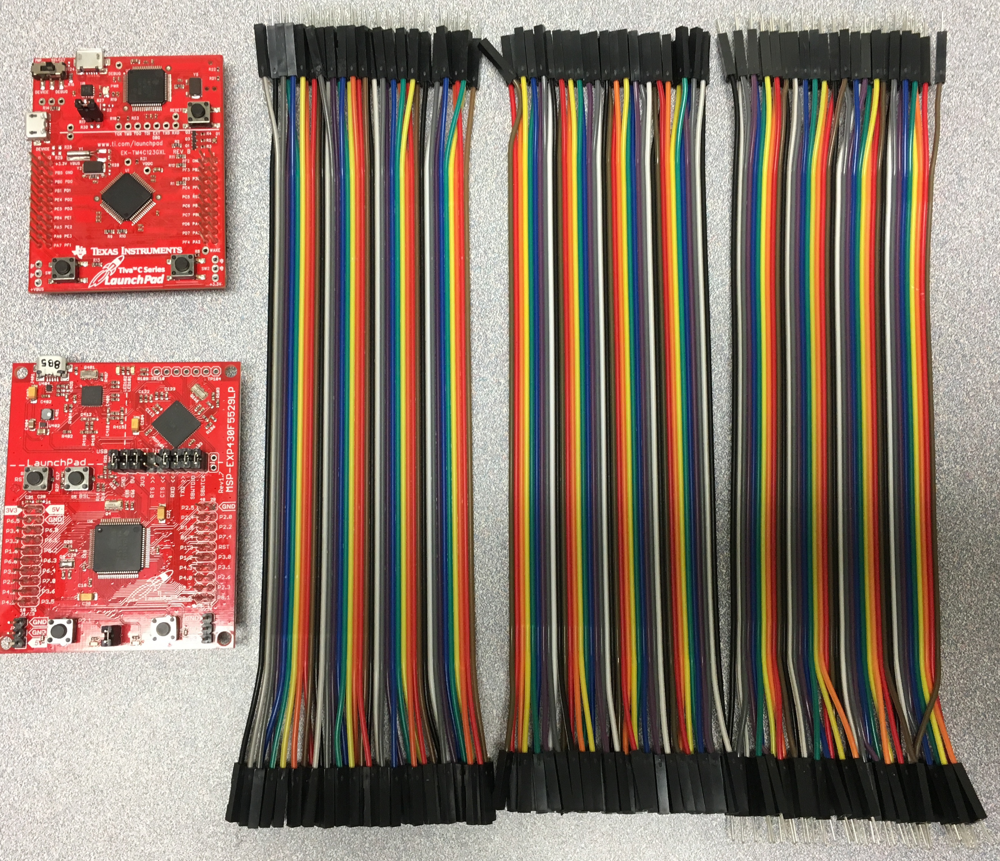

# TI-BH-basic-kit

This is a basic kit that includes two different kinds of TI Launchpad boards and jumper wires.   
Students who take ESET 369 course in *Spring of 2019* need to bring their own TI Launchpad boards and jumper wires.  

The detailed items were listed below. Students can choose to obtain them from several vendors such as TI, Amazon, digikey, or mouser.  

  

  

This basic kit:

- ARM Cortex-M4F Based MCU TM4C123G Launchpad Evaluation Kit (EK-TM4C123GXL)  
http://www.ti.com/tool/EK-TM4C123GXL?DCMP=stellaris-launchpad&HQS=tm4c123g-launchpad

- MSP430F5529 USB LaunchPad Evaluation Kit (MSP-EXP430F5529LP)  
http://www.ti.com/tool/MSP-EXP430F5529LP

- Breadboard Jumper Wire Set (Male to Female, Male to Male, and Female to Female)   
You can find several choices from many vendors
